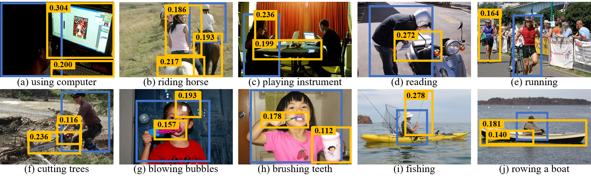

# Human-object Relation Network for Action Recognition in Still Images



## Introduction

Source Codes for the ICME 2020 paper: "Human-object Relation Network for Action Recognition in Still Images". 

View in [this repo](./paper.pdf) or [IEEE Digital Library](https://ieeexplore.ieee.org/document/9102933).

 Surrounding object information has been widely used for action recognition. However, the relation between human and object,
 as an important cue, is usually ignored in the still image action recognition field. In this paper, we propose a novel 
 approach for action recognition. The key to ours is a human-object relation module. By using the appearance as well as 
 the spatial location of human and object, the module can compute the pair-wise relation information between human and 
 object to enhance features for action classification and can be trained jointly with our action recognition network. 
 Experimental results on two popular datasets demonstrate the effectiveness of the proposed approach.
  Moreover, our method yields the new state-of-the-art results of 92.8% and 94.6% mAP on the PASCAL VOC 2012 Action and Stanford 40 
  Actions datasets respectively.

## Installation

This project is developed on `Python 3.6` with `MXNet` framework.

### Python Packages

```text
mxnet==1.6.0
gluoncv==0.7.0 [optional]
pycocotools==2.0 [optional]
numpy==1.15.4
matplotlib==2.2.2
tqdm==4.23.4
```

The optional packages are only required if you want to detect object bounding boxes for your own dataset.

### Datasets

| Name        | Dataset Download Link | Detected Object BBoxes |
|-------------|:-----------------------:|:-----------------------:|
| VOC 2012    | [Dataset Website](http://host.robots.ox.ac.uk:8080/pascal/VOC/voc2012/index.html#devkit) | [Dropbox](https://www.dropbox.com/sh/j7tsg5se05syua2/AAC0BhoKMs0OeCI4kYokHe9Sa?dl=0) OR [Baidu Net Disk](https://pan.baidu.com/s/1TOo-7M5JgROCuqinikRSeg) (PassCode: z53z) |
| Stanford 40 | [Dataset Website](http://vision.stanford.edu/Datasets/40actions.html) | [Dropbox](https://www.dropbox.com/sh/j7tsg5se05syua2/AAC0BhoKMs0OeCI4kYokHe9Sa?dl=0) OR [Baidu Net Disk](https://pan.baidu.com/s/1TOo-7M5JgROCuqinikRSeg) (PassCode: z53z) |
| HICO        | [Dataset Website](http://www-personal.umich.edu/~ywchao/hico/) | [Dropbox](https://www.dropbox.com/sh/j7tsg5se05syua2/AAC0BhoKMs0OeCI4kYokHe9Sa?dl=0) OR [Baidu Net Disk](https://pan.baidu.com/s/1TOo-7M5JgROCuqinikRSeg) (PassCode: z53z) |

**Note:**
For easy to use, we provide the object bounding boxes used in our paper, which are detected by Faster RCNN. 


1. VOC 2012 dataset:  
   1.1 Download the dataset and extract it to `~/Data/`.  
   1.2 Download the BBoxes and extracted it to `~/Data/VOCdevkit/VOC2012/`.

2. Stanford 40 dataset:  
   2.1 Download the dataset and extract it to `~/Data/`.  
   2.2 Download the BBoxes and extracted it to `~/Data/Stanford40/`.
   
3. HICO dataset:  
   3.1 Download the dataset and extract it to `~/Data/`.  
   3.2 Move all images in `~/Data/hico/images/train2015` and `~/Data/hico/images/test2015` into 
   its parent folder `~/Data/hico/images/`.  
   3.3 Download the BBoxes and extracted it to `~/Data/hico/`.

## Training

1. Download the pretrained ResNet-50/101 weights, put the weights into `~/.mxnet/models/`.
   - ResNet Weights: [Dropbox](https://www.dropbox.com/sh/saybys4tevjmv6r/AADxUT04FGfdAx9nI0EAH6_Ca?dl=0) OR [Baidu Net Disk](https://pan.baidu.com/s/1mcnFX0xEZ_h7oexdHKMBfA) (PassCode: ab4r)
2. Execute the shell script in `./experiments/[dataset]/`, such as:
   ```text
   sh ./experiments/VOC2012/train.sh
   ```

## Evaluation

1. Download the pretrained Models or prepare your trained models.
   - Pretrained Models: [Dropbox](https://www.dropbox.com/sh/xw3hwwa9fc4miaa/AADrzpgrEDyIX-PyOmD6drnTa?dl=0) OR [Baidu Net Disk](https://pan.baidu.com/s/1NR0W0k04MypQ1z_O_S_0nA) (PassCode: kjok)
2. Modify the parameter file path in the `test.sh` below `./experiments/[dataset]/`.
3. Execute the testing script, such as:
   ```text
   sh ./experiments/VOC2012/test.sh
   ```


## Models & Results

**Pretrained Models:** [Dropbox](https://www.dropbox.com/sh/xw3hwwa9fc4miaa/AADrzpgrEDyIX-PyOmD6drnTa?dl=0) OR [Baidu Net Disk](https://pan.baidu.com/s/1NR0W0k04MypQ1z_O_S_0nA) (PassCode: kjok)

| File Name                                   |   Dataset   | Split |  Backbone  | mAP(%) |
|---------------------------------------------|:-----------:|:-----:|:----------:|:------:|
| horelation_resnet50_v1d_voc_2012.params     |   VOC 2012  |  Val  |  ResNet-50 |  91.9  |
| horelation_resnet50_v1d_stanford_40.params  | Stanford 40 |  Test |  ResNet-50 |  93.1  |
| horelation_resnet101_v1d_stanford_40.params | Stanford 40 |  Test | ResNet-101 |  94.6  |
| horelation_resnet50_v1d_hico.params         |     HICO    |  Test |  ResNet-50 |  42.6  |

## Citation

If you feel our code or models helps in your research, kindly cite our papers:

```text
@INPROCEEDINGS{horelation,
author={Wentao Ma and Shuang Liang},
booktitle={2020 IEEE International Conference on Multimedia and Expo (ICME)},
title={Human-Object Relation Network For Action Recognition In Still Images},
year={2020}}
```


## Disclaimer

This repository used code from [MXNet](https://github.com/dmlc/mxnet),
[Gluon CV](https://github.com/dmlc/gluon-cv).


